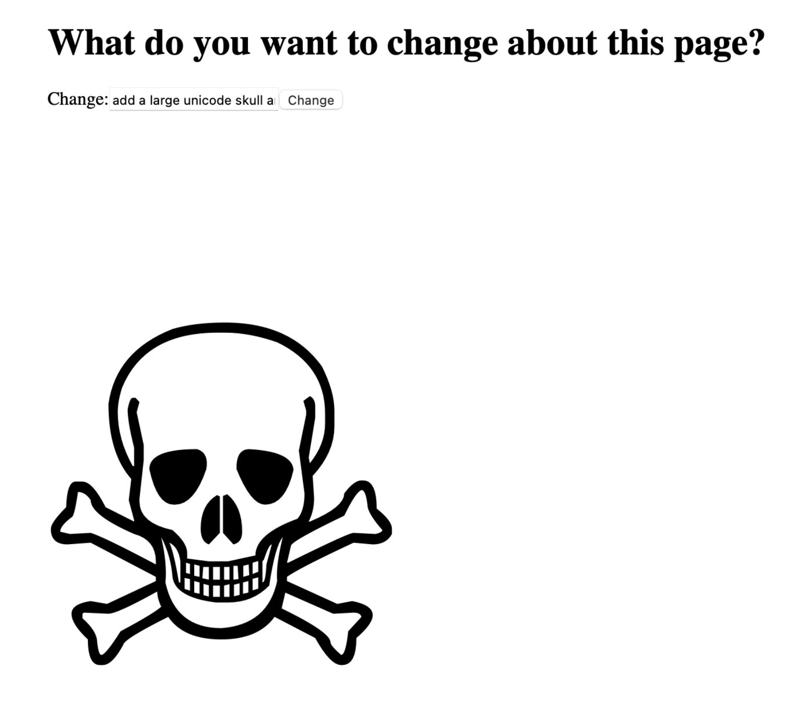

# Chat Page

A web page that uses ChatGPT prompting to modify its own markup.
E.g. "add a large unicode skull and crossbones 500px tall"

The application is built with Flask, and utilizes the OpenAI API for code generation.

## Example
[https://chatpage.herokuapp.com/](https://chatpage.herokuapp.com)

NB:
- If you give too complicated of a prompt, it will take ChatGPT too long to respond and the Heroku 30s/request limit will time out your request
- Changes to index.html are in ephemeral storage and will be lost every time the Heroku dyno restarts
- The application utilizes a session-based system to allow multiple users to access the application simultaneously without interference

## Development

- Clone the repository to your local machine
- Ensure you have flask and openai libraries installed
- Add your OpenAI API key as an environment variable named `OPENAI_API_KEY`
- Start the application with `python app.py`
- Access the application in your browser at `localhost:5000`
